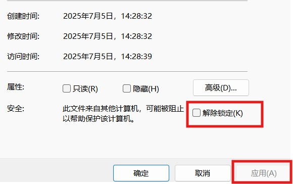

# miHoYo抽卡链接获取脚本

## 简介

本仓库包含了用于获取miHoYo游戏抽卡链接的脚本。脚本命名方式为游戏名。适用于windows命令行运行。

## 功能概述

脚本会从游戏日志文件或指定路径获取游戏路径，接着复制特定缓存数据文件，从缓存数据里解析出抽卡链接，过滤链接参数后将最终链接输出并复制到剪贴板。

## 运行环境

- PowerShell
- 需要 .NET 环境支持

## 使用方法

### 自动模式

若不提供任何参数，脚本会尝试从游戏日志文件定位游戏路径：

```powershell
.\StarRail20250704.ps1
```

### 手动模式

若已知游戏路径，可将其作为参数传入脚本，例如：

```powershell
.\StarRail.ps1 "D:/Program Files/miHoYo Launcher/games"
```

## 错误处理



可能需要在属性中解除锁定
